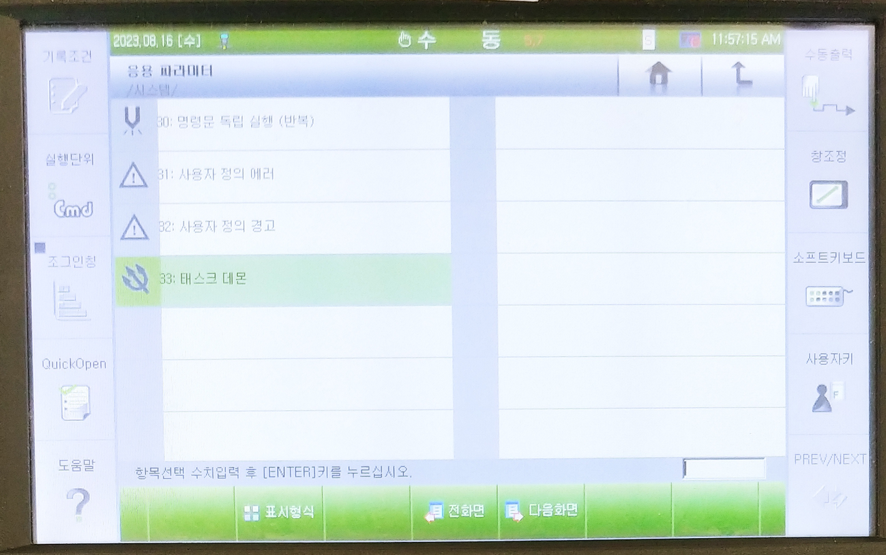
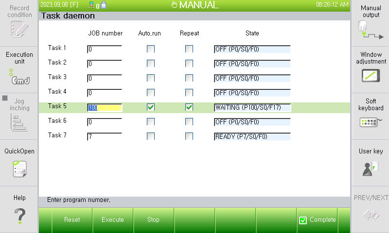

# 2.1. 설정

`[F2: 시스템] - 4: 응용 파라미터 - 33: 태스크 데몬`을 선택하십시오.

 

아래와 같은 설정화면이 열립니다.  
태스크 1 ~ 태스크 7에 대한 설정이 가능합니다. (태스크 0은 데몬으로 사용할 수 없습니다.)

- `JOB 번호` 항목에 JOB 번호를 입력하면, 그 번호를 메인 프로그램으로 하여 데몬으로 실행하도록 태스크가 설정됩니다.  
0으로 설정되어 있으면, 해당 태스크는 데몬으로 사용하지 않습니다. 즉 데몬 OFF 상태입니다.

- `자동 실행`을 체크하면, 설정을 완료하거나 제어기를 부팅했을 때 자동으로 데몬이 실행됩니다.
- `반복`을 체크하면, JOB CYCLE이 완료되었을 때 처음부터 다시 반복 수행됩니다. 즉, `조건설정 - 동작 사이클` 설정을 `반복`으로 설정한 것과 같은 개념입니다.

- `상태` 항목에는 태스크의 현재 상태와 함께 괄호 안에 현재 프로그램 카운터(프로그램 번호/스텝 번호/펑션 번호)가 표시됩니다.

  - OFF (꺼짐) : 데몬으로 사용하지 않는 상태입니다.
  - OCCUPIED (점유) : 멀티태스크 기능에 의해 점유되어 사용 중인 태스크입니다. 데몬으로 사용할 수 없습니다.
  - READY (준비) : 프로그램 헤더에서 기동(START) 되기를 기다리는 상태입니다.
  - RUN (실행) : 데몬으로 재생 중인 상태입니다.
  - STOP (정지) : 실행이 정지된 상태입니다.
  - WAITING (대기) : DELAY문이나 WAIT문, INPUT문 등에서 대기 중인 상태입니다.
  - ERROR (에러) : 에러가 발생한 상태입니다. 에러코드가 같이 표시되기도 합니다.
  - END (종료) : JOB CYCLE이 완료된 상태입니다.

하단의 F키들로 현재 커서가 위치한 태스크에 대해 수동 조작을 할 수 있습니다.

- `[F1: 리셋]` : 선택된 태스크를 정지시키고, 리셋을 수행합니다. R0[ENTER]를 수행한 것과 같은 개념입니다. 모든 호출 정보와 지역변수가 클리어되고, 프로그램 카운터는 메인 프로그램 헤더 위치에 놓입니다.
- `[F2: 실행]` : STOP 혹은 READY 나 END 상태의 태스크 데몬을 기동시킵니다. START (기동) 버튼을 누르는 것과 같은 개념입니다.
- `[F3: 정지]` : RUN 혹은 WAITING 상태의 태스크 데몬을 정지시킵니다. STOP (정지) 버튼을 누르는 것과 같은 개념입니다.

- `[F7: 완료]` : 설정을 저장하고, 설정 화면을 닫습니다. `자동 실행`으로 설정한 태스크 데몬은 실행을 시작합니다.
