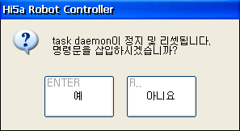

# 2.3. JOB editing

The main JOB programs or sub-JOB programs in the task daemon are freely editable. However, if you insert/delete a command statement or edit an IF statement when these programs are in the call stack (i.e., running), the following confirmation dialog box appears.

Pressing the `[ENTER]` key stops and resets the task daemon. Press the `[ESC]` key to cancel the edit.

And, if you delete a JOB program in the call stack, its daemon execution is interrupted and initialized.
