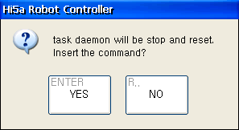

# 2.3. JOB 편집

태스크 데몬의 메인 JOB 프로그램이나 서브 JOB 프로그램들은 자유롭게 편집할 수 있습니다. 다만 이 프로그램들이 호출 스택에 있을 때(즉, 실행 중에 있을 때)에 명령문 삽입/삭제 혹은 IF문 편집을 수행하면, 아래와 같은 확인 대화상자가 나타납니다.

`[ENTER]` 키를 누르면, 해당 태스크 데몬이 정지 및 리셋됩니다. `[ESC]` 키를 누르면, 편집이 취소됩니다.

또한 호출 스택에 있는 JOB 프로그램을 삭제하면, 해당 daemon 실행이 동작이 중단되고 초기화됩니다.
